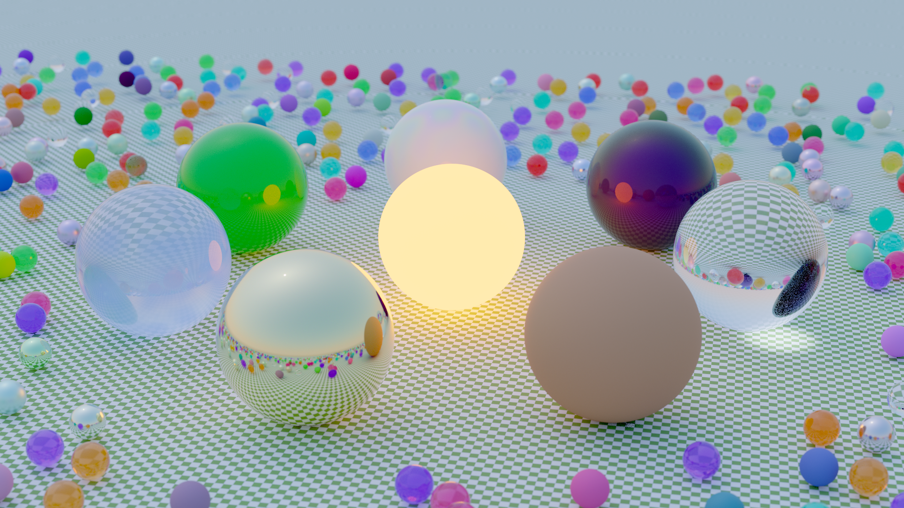
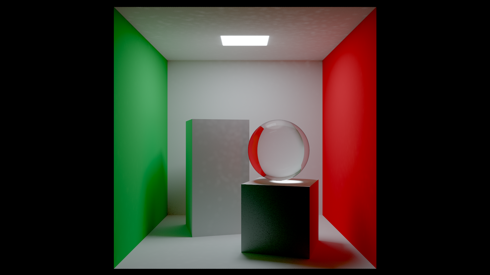
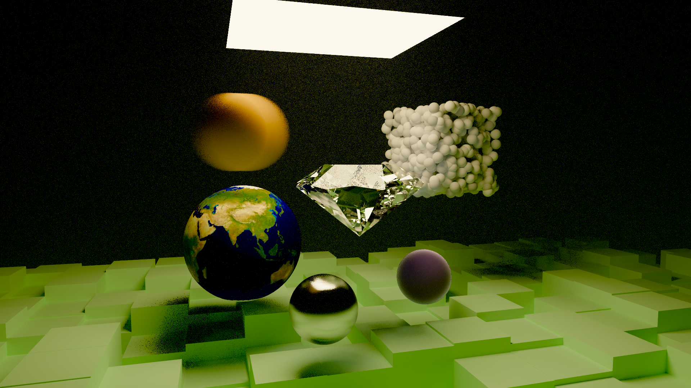
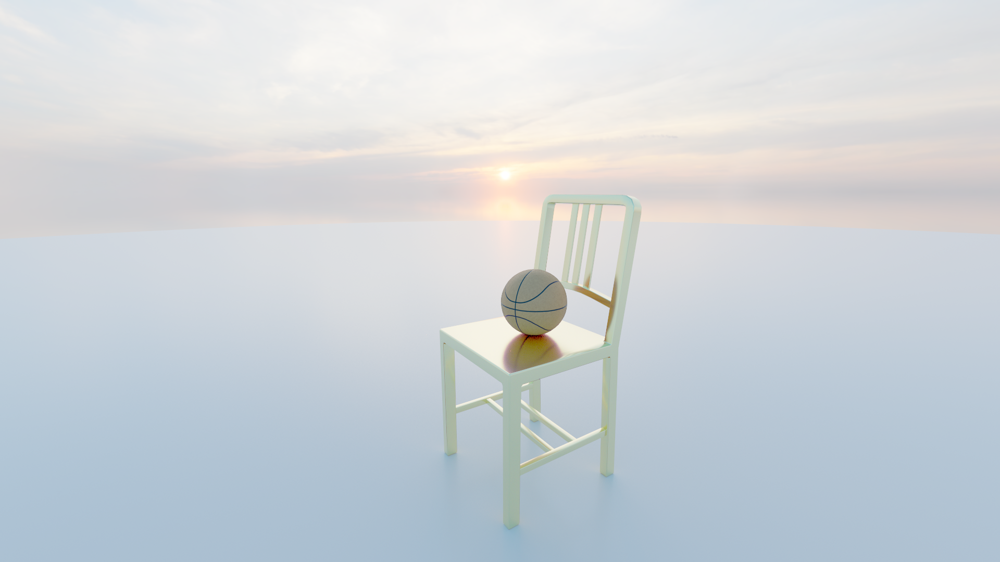

# rustracer

A physically-based path tracer built in Rust. It simulates how light actually behaves — bouncing, refracting, and scattering through a scene — to produce photorealistic images. It runs interactively in a window and can also render to PNG in headless mode.

## Gallery

|                                             Random Spheres                                             |                                           Cornell Box                                            |
|:------------------------------------------------------------------------------------------------------:|:------------------------------------------------------------------------------------------------:|
|  5000 samples per pixel + AgX tonemapping |  5000 samples per pixel + AgX tonemapping |

|                                Next Week                                |                                                                             Custom Scene (OBJ)                                                                             |
|:-----------------------------------------------------------------------:|:--------------------------------------------------------------------------------------------------------------------------------------------------------------------------:|
|  5000 samples per pixel + AgX tonemapping |  HDR background, 1 OBJ with texture mapping + 1 OBJ with spectral material - 5000 samples per pixel + AgX tonemapping |

### Animation — 360° orbit

Camera orbit around a gold chair and basketball, 144 frames at 24 fps rendered with adaptive sampling.

<video src="examples/obj_loading.mp4" controls width="100%"></video>

## Build & Run

```sh
cargo run --release                        # interactive viewer
cargo run --release -- --render [options]  # headless PNG render
cargo run --release -- --bench             # performance benchmark
```

### Headless render options

```
--scene <name>       random | cornell | nextweek | <path.toml>
--samples <n>        samples per pixel (default: scene maximum; unused with --adaptive)
--width  <n>         output width  in pixels (default: 1200)
--height <n>         output height in pixels (default: 800)
--exposure <f>       exposure multiplier (default: 1.0)
--output <path>      output PNG path (default: auto-generated)
--tonemapper <name>  agx or aces (default: agx)
--adaptive              adaptive sampling: run until the convergence target is reached
--convergence <pct>     convergence target in % (default: 99.0; requires --adaptive)
--min-samples <n>       minimum SPP before any pixel may be marked converged (default: 128; requires --adaptive)
--denoise [strength]    run OIDN after render; optional blend strength in [0.0, 1.0] (default: 1.0, requires denoise feature)
```

### OIDN denoising (optional)

Install [Intel Open Image Denoise](https://openimagedenoise.github.io) via Homebrew:

```sh
brew install open-image-denoise
cargo run --release --features denoise
```

Press **N** in-app to toggle denoising. The denoiser runs on a background thread and updates every 32 samples.

## Controls

| Key | Action |
|-----|--------|
| 1–4 | Switch scene |
| F | Toggle free camera (WASD + mouse look) |
| C | Reset camera |
| R | Restart / reload scene |
| Space / Shift | Move up / down (free cam) |
| , / . | Decrease / increase FOV |
| I / O | Decrease / increase aperture |
| - / = | Decrease / increase exposure |
| Arrows | Rotate sun (Physical sky scenes) |
| T | Toggle tonemapper (AgX / ACES) |
| V | Toggle adaptive sampling |
| M | Toggle photon map (caustics on/off) |
| L | Print current camera position to terminal (TOML format for scene.toml) |
| P | Save PNG |
| Enter | Pause / resume rendering |
| N | Toggle OIDN denoising (`denoise` feature) |
| J / K | Decrease / increase denoise blend |
| ? | Reprint controls |
| Esc | Release mouse / quit |

## Features

### Rendering

Path tracing works by sending many rays from the camera into the scene. Each ray bounces around — hitting surfaces, scattering, sometimes hitting a light — and the average of thousands of these paths gives you the final pixel colour. More samples per pixel means less noise.

- **Unidirectional path tracing** with full global illumination (indirect lighting, colour bleeding, soft shadows — all emerge naturally from the simulation)
- **Next-event estimation (NEE) with MIS** — at each diffuse bounce, an extra shadow ray is cast directly toward area lights. This greatly reduces noise in scenes with small or bright lights, where a random bounce is unlikely to hit them by chance. The direct and indirect contributions are balanced with the MIS balance heuristic so light is never counted twice.
- **Cosine-weighted hemisphere sampling** for diffuse indirect bounces — samples are biased toward directions that contribute more energy, reducing variance without introducing bias
- **Depth of field** — rays are scattered across a simulated lens aperture, producing realistic out-of-focus blur. Bokeh shape is controlled by a configurable blade count.
- **Motion blur** — objects can be assigned a velocity; rays are jittered in time to simulate shutter opening

### Spectral rendering

Most path tracers work entirely in RGB — red, green, and blue channels. This tracer optionally goes further by simulating actual wavelengths of light, which enables physically correct phenomena that RGB cannot reproduce.

- **Hero-wavelength spectral rendering** — one wavelength λ (between 380 and 700 nm) is sampled per camera ray and tracked through all bounces. The final colour is reconstructed using the CIE 1931 colour matching functions, which define how human eyes convert wavelengths to RGB perception.
- **SpectralDielectric** — glass whose refractive index depends on wavelength (Cauchy equation: `n(λ) = B + C/λ²`). Different colours bend by different amounts, producing chromatic aberration in lenses and rainbow caustics from prisms.
- **SpectralMetal** — conductor Fresnel reflectance computed from measured IOR data (Johnson & Christy 1972) for Gold, Copper, and Silver. The colour shift with viewing angle is physically exact, not approximated.

### Acceleration

Path tracing is expensive — every pixel needs thousands of ray-scene intersection tests. Several layers of optimisation make it interactive:

- **QBVH (8-wide Bounding Volume Hierarchy)** — the scene is wrapped in a tree of axis-aligned bounding boxes. Ray traversal tests 8 child nodes simultaneously using AVX2 SIMD instructions, with a 4-wide SSE2/NEON fallback on other hardware. Shadow rays use a faster `any_hit()` variant that exits at the first hit.
- **Parallelised tile rendering** via Rayon — the image is divided into tiles, each rendered by a separate CPU thread simultaneously
- **Adaptive sampling** — pixels that have already converged (low luminance variance) are skipped in subsequent passes, concentrating samples where they're still needed. In headless mode, rendering stops once a configurable percentage of pixels have converged (`--convergence`, default 99%), rather than at a fixed SPP count. A minimum sample floor (`--min-samples`, default 128) ensures all pixels receive a quality baseline before convergence checks begin.

### Caustics (Photon Mapping)

Caustics are the bright, curved light patterns formed when light focuses through a curved transparent surface — like the rippling bright patches at the bottom of a swimming pool, or the rainbow cast by a glass prism. Standard path tracing struggles with caustics because it relies on rays randomly finding the exact path through the lens, which is extremely unlikely.

This tracer uses a **photon map** to solve this: a separate forward-tracing pass shoots photons from light sources, stores where they land (after refracting through glass), and builds a kd-tree over them. During the main render, the density of stored photons near a surface point is used to estimate caustic radiance.

- Balanced kd-tree (median-split, widest-axis) built once at scene construction
- Epanechnikov kernel density estimation
- Hemisphere normal filtering: photons whose stored surface normal opposes the shading normal are rejected, preventing caustic light from leaking through opaque geometry
- Only paths through spectral materials (`SpectralDielectric`, `SpectralMetal`) contribute photons

### Backgrounds

Two background modes are supported, configured per scene:

**Physical sky** — an analytical atmospheric scattering model. Sun position is controlled by azimuth and elevation angles (also adjustable with arrow keys at runtime). Produces a physically plausible sky gradient with sun disk and a horizon haze. Does not require any external file.

```toml
[background]
type          = "physical"
sun_azimuth   = -55.0
sun_elevation = 32.0
```

**Environment map** — a real-world HDR photo of an environment wrapped around the scene as a spherical backdrop. Any ray that escapes the scene without hitting geometry samples the environment map instead, giving the scene accurate real-world lighting colours and a photographic background.

Both `.hdr` (Radiance RGBE) and `.exr` (OpenEXR) files are supported. Files of any size can be loaded — the image reader has no memory cap. HDRI sky packs from sites like Poly Haven work out of the box.

```toml
[background]
type = "env_map"
path = "assets/sunset_puresky_4k.hdr"
```

Environment maps are importance-sampled using a 2D hierarchical CDF built from pixel luminance, weighted by sin θ to compensate for the equirectangular Jacobian. At each diffuse bounce, NEE explicitly samples the most likely directions in the env map, so diffuse surfaces converge at roughly the same rate as under the physical sky.

### Materials

| Material | Description |
|----------|-------------|
| `Lambertian` | Cosine-weighted diffuse; accepts a solid colour or a texture |
| `PbrMaterial` | Full GGX microfacet BRDF — anisotropic VNDF sampling (Heitz 2018), metallic/roughness workflow, optional clearcoat, sheen, and emissive lobes |
| `TexturedPbr` | Same as PbrMaterial but driven by image maps (albedo, roughness, metallic, ambient occlusion). Also supports **tangent-space normal maps** — see below. |
| `Dielectric` | Schlick-Fresnel glass with configurable IOR (index of refraction) |
| `SpectralDielectric` | Dispersive glass via the Cauchy equation; requires hero-wavelength rendering for correct chromatic aberration |
| `SpectralMetal` | Conductor Fresnel from measured J&C 1972 IOR tables (Au, Cu, Ag) |
| `SssMaterial` | Subsurface scattering with Beer–Lambert absorption — light enters and exits at different points, giving a wax- or skin-like appearance |
| `PearlMaterial` | Thin-film iridescence with a nacre lookup table; colour shifts with view angle |
| `BlackbodyLight` | Emissive surface with a Planck blackbody spectrum at a given temperature (in Kelvin) |
| `DiffuseLight` | Flat-colour emissive surface; colour values above 1.0 act as HDR brightness |

#### Normal maps

`TexturedPbr` supports tangent-space normal maps. These are images where the RGB values encode a surface normal direction (red = X, green = Y, blue = Z in tangent space). They let a low-polygon mesh appear to have fine geometric detail — bumps, seams, and surface texture — without actually adding geometry.

The implementation:
1. **Per-vertex tangents** are computed from UV-space derivatives during OBJ loading and averaged across shared vertices.
2. At ray–triangle intersection, the tangent is interpolated barycentrically and Gram-Schmidt orthogonalised against the shading normal.
3. At shade time, a TBN matrix (Tangent, Bitangent, Normal) transforms the decoded normal map sample from tangent space into world space.

The normal map path in `scene.toml`:

```toml
material.normal_path = "assets/textures/basketball_normal.png"
```

Normal maps follow the OpenGL convention (green channel points up in tangent space). If bumps appear inverted, negate the green channel in the image.

### Post-processing

- **AgX** tonemapper (default) — a filmic response curve designed to handle very bright highlights gracefully without the harsh clipping or colour hue shift that simpler curves produce. Developed by Troy Sobotka.
- **ACES** tonemapper — the Academy Color Encoding System; a full RRT + ODT pipeline used in film production.
- Optional **OIDN denoising** — Intel's AI-based denoiser runs on a background thread. The denoised result is blended into the live view; blend strength is adjustable with J/K.

## Custom scenes (scene.toml)

Scenes can be defined in TOML files. Press **4** in the viewer to load `scene.toml` from the working directory, or use `--scene path/to/file.toml` for headless renders. Press **R** to hot-reload after editing.

### Shapes

```toml
{ type = "sphere",         center = [x,y,z], radius = r }
{ type = "box",            p_min = [x,y,z],  p_max = [x,y,z] }
{ type = "cylinder",       center = [x,y,z], radius = r, height = h }
{ type = "cone",           center = [x,y,z], radius = r, height = h }
{ type = "disk",           center = [x,y,z], normal = [x,y,z], radius = r }
{ type = "infinite_plane", point  = [x,y,z], normal = [x,y,z] }
{ type = "mesh",           path   = "assets/file.obj" }
{ type = "diamond",        center = [x,y,z], radius = r }
# optional GIA proportion fields (all default to the Tolkowsky ideal cut when omitted):
#   table_pct = 53.0, crown_angle = 34.5, pavilion_angle = 40.75
```

> Use `disk` rather than `infinite_plane` when an env map is the background — an infinite plane extends to the horizon and will clip into the sky. A disk with radius 20–30 gives a clean ground without reaching the skyline.

### Transforms

Per-object transforms are applied in SRT order (scale → rotate\_y → translate):

```toml
scale     = 0.01        # uniform scale factor (e.g. cm → m for most OBJ exports)
rotate_y  = 90.0        # degrees around the world Y axis
translate = [x, y, z]  # world-space offset applied last
```

### Materials

```toml
{ type = "lambertian",          color = [r,g,b] }
{ type = "checker",             even = [r,g,b], odd = [r,g,b], scale = 1.0 }  # 3-D checker; scale = tile size in world units
{ type = "metal",               color = [r,g,b], fuzz = 0.0 }
{ type = "dielectric",          ior = 1.5 }
{ type = "spectral_dielectric", ior = 1.8, dispersion = 0.02 }
{ type = "diffuse_light",       color = [r,g,b] }   # values > 1.0 = HDR bright
{ type = "pbr",                 albedo = [r,g,b], metallic = 0.0, roughness = 0.5 }
{ type = "spectral_metal",      variant = "gold",   roughness = 0.1 }  # gold | copper | silver
{ type = "pearl",               film_thickness = 400.0, film_scale = 1.0, orient_strength = 0.5 }
```

TexturedPbr (all fields except `albedo_path` are optional):

```toml
material.type          = "textured_pbr"
material.albedo_path   = "assets/textures/colour.png"
material.roughness_path = "assets/textures/roughness.png"
material.metallic_path = "assets/textures/metallic.png"
material.ao_path       = "assets/textures/ao.png"
material.normal_path   = "assets/textures/normal.png"
material.roughness     = 0.5    # fallback if no roughness map
material.metallic      = 0.0    # fallback if no metallic map
```

### Caustics

```toml
[caustics]
enabled       = true
gather_radius = 0.15      # world units; increase for smoother/brighter, decrease for sharper
num_photons   = 500_000   # increase for small objects where most photons miss (e.g. 5_000_000 for a small diamond)
```

> **Note:** Turbidity for the physical sky must be ≥ 1.7. Values below that cause the Preetham model's normalisation coefficient to go negative, producing a black sky.

### Animation

Scenes can define a camera animation that renders each frame to a numbered PNG and prints an ffmpeg command at the end.

**Orbit** — perfect circular path computed trigonometrically; no spline artifacts:

```toml
[animation]
fps      = 24
duration = 6.0   # seconds → fps × duration frames total

[animation.orbit]
center      = [x, 0.0, z]   # XZ of the orbit axis (Y is ignored; set by height)
radius      = 4.5
height      = 2.0            # world-space Y of the camera
look_at     = [x, y, z]     # fixed point the camera points at
start_angle = 0.0            # degrees; 0° = +Z from center, clockwise from above
end_angle   = 360.0          # 360° = full orbit back to start
```

**Keyframes** — smooth Catmull-Rom spline through arbitrary camera positions:

```toml
[animation]
fps      = 24
duration = 4.0

[[animation.keyframes]]
time      = 0.0
look_from = [x, y, z]
look_at   = [x, y, z]
# vfov, aperture, focus_dist are optional (inherit from [camera] when omitted)

[[animation.keyframes]]
time      = 4.0
look_from = [x, y, z]
look_at   = [x, y, z]
```

Render an animation:

```sh
cargo run --release -- --render --scene myfile.toml --adaptive --min-samples 64
```

Frame files are written as `{slug}_{frame:04d}.png`. After the last frame the assemble command is printed:

```sh
ffmpeg -r 24 -i "slug_%04d.png" -c:v libx264 -pix_fmt yuv420p output.mp4
```

The BVH and photon map are built **once** and reused across all frames — only the camera is reconstructed per frame.

## Scenes

1. **Random Spheres** — Physical sky, large checkerboard ground. A glowing emissive PBR ember sits at the centre, casting warm orange light on the ring of seven hero spheres surrounding it: SpectralDielectric crown glass, rough terracotta PBR, Gold SpectralMetal, a NoiseMedium Perlin-cloud trapped inside a glass sphere, SSSMaterial jade, pearl, and an iridescent clearcoat PBR. About 350 small randomly placed diffuse, glass, and SSS balls fill the background. Spectral-material caustics are projected onto the ground by the sun.

2. **Cornell Box** — The classic renderer benchmark scene: coloured walls, two boxes, and a 6500 K blackbody area light. Contains a SpectralDielectric dense-flint glass sphere (which produces rainbow caustics on the floor) and a SpectralMetal gold sphere. Photon-map caustics enabled.

3. **Next Week** — A sampler of many features: area light, motion-blurred sphere, Dielectric glass sphere, metallic PBR sphere, blue volumetric fog sphere, earth-texture sphere, Perlin-noise sphere, SpectralDielectric diamond below the light, pearl sphere, a cluster of 1000 small white spheres, and a global mist medium. Photon-map caustics enabled.

4. **Custom scene** (`scene.toml`) — Loaded from the working directory. Currently: old wooden chair and basketball OBJ meshes with PBR textures (including a normal map on the basketball), polished concrete disk floor, sunset HDR environment map.

## Implementation notes

- Release builds use `target-cpu=native`, fat LTO, and a single codegen unit for maximum instruction throughput
- QBVH node width (8 vs 4) is selected at compile time via `#[cfg(target_feature = "avx2")]`
- Spectral CMF weight is applied at the first spectral bounce via a `spectral_weighted` flag; subsequent bounces multiply by a scalar reflectance so the weight is never compounded
- MIS weight: `w_nee = p_nee / (p_nee + p_brdf)` (balance heuristic); emitted radiance is accumulated only on camera rays and after specular bounces to avoid double-counting with NEE. Area light, sun, and env map NEE contributions are all pooled into a single combined PDF.
- Environment map importance sampling uses a 2D CDF (row marginal × per-row conditional) built from luminance × sin θ. Sampling is a two-level binary search (`partition_point`) with sub-pixel jitter; the solid-angle PDF `p_ω = L·W·H·inv_total / (2π²)` is used for MIS weighting against the BRDF PDF.
- Shading normals from normal maps feed all PDF and BRDF evaluation paths (`scattering_pdf`, `specular_brdf_cos`, `specular_sampling_pdf`, `CosinePdf`), not just scatter direction — keeping MIS weights consistent with the actual scattering geometry.
- Photon kd-tree is built with `select_nth_unstable_by` (in-place median partition, O(N log N)); queries recurse with split-plane pruning (O(√N) average for range queries)
- Adaptive sampling tracks per-pixel luminance variance (Welford online algorithm); pixels below the relative convergence threshold (`ADAPTIVE_THRESHOLD`) are skipped in subsequent passes. Convergence checks are suppressed until `--min-samples` (default 128) have been accumulated, ensuring all pixels have a quality baseline before early-exit can trigger. In headless mode the render exits once the `--convergence` percentage of pixels have converged (default 99%), rather than at a fixed SPP ceiling — 100% is intentionally avoided since a small number of high-variance pixels (near caustics, light edges) converge orders of magnitude slower than the rest.
- OIDN runs on a background thread; its result is blended into the display buffer without blocking the render loop
- Environment maps are loaded with no memory cap — files of any size are supported
- Normal map tangents are computed in a two-pass algorithm: first accumulate per-face tangents into per-vertex accumulators, then normalise and Gram-Schmidt orthogonalise at shade time

### Compile-time tuning knobs

These constants can be adjusted in source before building:

| Constant | File | Default | Effect |
|---|---|---|---|
| `MAX_DEPTH` | `src/renderer.rs` | `50` | Maximum ray bounce depth. Lower values cut render time but lose energy in scenes with lots of glass or mirrors. |
| `ADAPTIVE_THRESHOLD` | `src/main.rs` | `0.05` | Relative standard error (σ/μ) below which a pixel is considered converged and skipped. Lower = more samples before early exit. |
| `FIREFLY_CLAMP` | `src/main.rs` | `8.0` | A sample whose luminance exceeds this multiple of the running pixel mean is scaled down to that ratio × mean. Higher values preserve more energy at the cost of occasional bright spikes. |
| `FIREFLY_MIN_SAMPLES` | `src/main.rs` | `4` | Minimum samples before per-pixel firefly clamping activates. |
